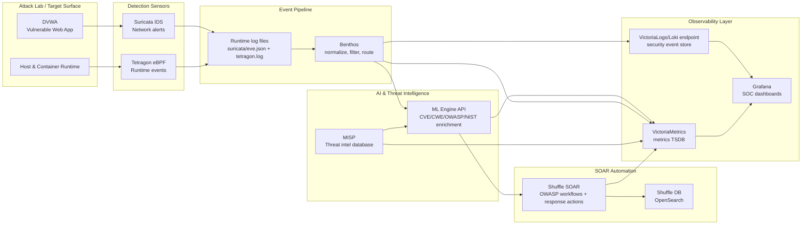
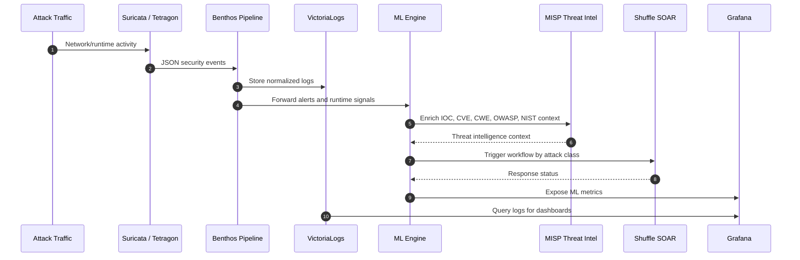
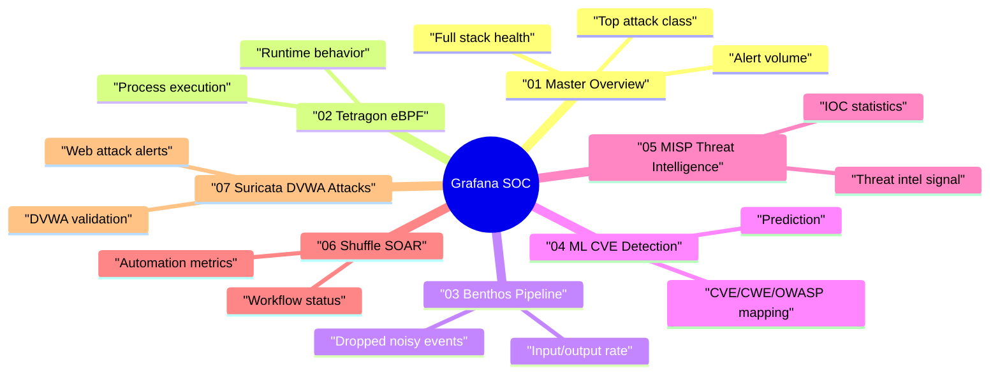
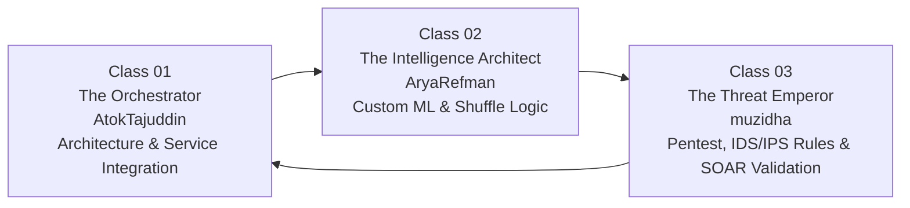

# Nexus Sentinel — Custom Big SOC Architecture

> Docker Compose-based Security Operations Center (SOC) stack with ML-powered threat detection, SOAR automation, threat intelligence enrichment, and integrated observability.

---

## Big Picture Architecture



## Detection & Response Flow



## Service Layers

| Layer | Components | Function |
|-------|------------|----------|
| Attack Lab | DVWA | Vulnerable web target used to validate detection coverage |
| Sensor | Suricata, Tetragon | Captures network alerts and eBPF-based runtime events |
| Pipeline | Benthos | Reads logs, filters noise, and routes events to the log store and ML engine |
| Intelligence | ML Engine, MISP | Classifies attack classes and enriches events with CVE/CWE/OWASP/NIST and IOC context |
| Automation | Shuffle SOAR, OpenSearch | Runs automated response workflows and stores Shuffle state |
| Observability | VictoriaLogs, VictoriaMetrics, Grafana | Stores logs/metrics and powers SOC dashboards |

## Dashboard Map



## Identity & Role Class

**Product name:** **Nexus Sentinel**

Nexus Sentinel is a custom SOC platform that unifies sensors, pipelines, custom ML, threat intelligence, SOAR automation, and observability dashboards into one detection-and-response command center.



| Class | Codename | Person | Primary Domain | Responsibility |
|-------|----------|--------|----------------|----------------|
| **Class 01** | **The Orchestrator** | **AtokTajuddin** | Big-picture architecture, service integration, and stack maintenance | Designs the end-to-end flow; integrates Suricata, Tetragon, Benthos, VictoriaLogs, VictoriaMetrics, Grafana, MISP, ML Engine, and Shuffle; maintains service reliability when failures happen; keeps every component aligned inside the Nexus Sentinel architecture |
| **Class 02** | **The Intelligence Architect** | **AryaRefman** | Custom ML, enrichment logic, and ML-to-SOAR workflow connection | Builds the custom ML engine and its architecture; manages CVE/CWE/OWASP/NIST mapping; creates the logic that lets ML detection output trigger the correct Shuffle workflow; ensures SOAR automation can consume and act on custom ML results |
| **Class 03** | **The Threat Validator** | **muzidha** | Pentest validation, threat-flow testing, and custom detection rules | Executes pentest and attack simulations; validates that threats flow from IDS/IPS into the pipeline, custom ML, dashboard, and SOAR; creates custom Suricata/IDS/IPS rules; tests Shuffle workflows; verifies that every alert can be traced from attack execution to response action |

### Role Identity

| Role | Identity Statement |
|------|--------------------|
| **AtokTajuddin — The Nexus Orchestrator** | "design, integrate, and maintain the Nexus Sentinel architecture so every service stays connected, stable, and operational." |
| **AryaRefman — The Mindsmith** | "build the custom ML intelligence layer of Nexus Sentinel and connect it to SOAR logic so alerts become actionable response decisions." |
| **muzidha — The Red Sentinel** | "attack, test, and validate the full threat path so detection, dashboards, IDS/IPS rules, and SOAR automation work in real scenarios." |


---

## System Prerequisites

```bash
# Required kernel parameter for OpenSearch / Shuffle DB
sudo sysctl -w vm.max_map_count=262144

# Make it persistent after reboot
echo "vm.max_map_count=262144" | sudo tee -a /etc/sysctl.conf

# Disable swap, recommended for OpenSearch
sudo swapoff -a
```

---

## Running the Stack

### First Run / Full Start

```bash
cd /home/atokdins/Downloads/SOC_Local/soc_project

# Start all services
sudo docker compose up -d

# Watch startup progress
sudo docker compose logs -f --tail 20
```

### Staged Start Recommended

```bash
# 1. Start core monitoring first
sudo docker compose up -d tetragon suricata victoriametrics victorialogs benthos grafana

# 2. Start ML engine
sudo docker compose up -d ml-engine

# 3. Start MISP threat intelligence
sudo docker compose up -d misp-db misp-redis misp misp-exporter

# 4. Start Shuffle SOAR
# OpenSearch needs roughly 2 minutes to become ready
sudo docker compose up -d shuffle-db
sleep 60
sudo docker compose up -d shuffle-backend shuffle-frontend shuffle-exporter
```

### Stop / Restart

```bash
# Stop everything
sudo docker compose down

# Stop while keeping data volumes
sudo docker compose stop

# Restart a specific container
sudo docker restart <container-name>

# Rebuild and restart a specific service
sudo docker compose up -d --force-recreate <service-name>
```

---

## Checking Service Status

### All Container Status

```bash
sudo docker ps --format "table {{.Names}}\t{{.Status}}\t{{.Ports}}"
```

### Status by Category

```bash
# Core stack
sudo docker ps --format "table {{.Names}}\t{{.Status}}" | grep -E "tetragon|suricata|victoria|benthos|grafana"

# ML + SOAR
sudo docker ps --format "table {{.Names}}\t{{.Status}}" | grep -E "ml-engine|shuffle|misp"
```

### Per-Service Health Checks

```bash
# VictoriaMetrics
curl -s http://localhost:8428/health

# VictoriaLogs
curl -s http://localhost:9428/health

# ML Engine
curl -s http://localhost:8000/health

# Grafana
curl -s -o /dev/null -w "HTTP %{http_code}\n" http://localhost:3000/api/health

# Shuffle OpenSearch
sudo docker exec shuffle-db curl -s http://localhost:9200 | grep -o '"number":"[^"]*"'

# Benthos metrics
curl -s http://localhost:4195/metrics | grep benthos_input
```

---

## Resource Monitoring CPU & RAM

### Live Resource Usage

```bash
# All containers, updates every 2 seconds
sudo docker stats

# SOC services only, compact view
sudo docker stats --format "table {{.Name}}\t{{.CPUPerc}}\t{{.MemUsage}}\t{{.MemPerc}}" \
  tetragon suricata victoriametrics victorialogs benthos grafana ml-engine

# One-time snapshot without streaming
sudo docker stats --no-stream --format "table {{.Name}}\t{{.CPUPerc}}\t{{.MemUsage}}"
```

### Host RAM

```bash
# Total RAM usage
free -h

# Per-process details
htop

# Alternative
top
```

### Docker Volume Disk Usage

```bash
# All Docker volumes
sudo docker system df -v

# Project folder
du -sh /home/atokdins/Downloads/SOC_Local/soc_project/logs/*
du -sh /home/atokdins/Downloads/SOC_Local/soc_project/
```

---

## Dashboard & Service Access

| Service | URL | Login |
|---------|-----|-------|
| **Grafana** | http://localhost:3000 | admin / minisoc2026 |
| **Shuffle SOAR** | http://localhost:3001 | admin / Admin1234! |
| **ML Engine API** | http://localhost:8000 | - |
| **ML Engine Docs** | http://localhost:8000/docs | - |
| **MISP** | http://localhost:8081 | admin@admin.test / admin |
| **VictoriaMetrics** | http://localhost:8428/vmui | - |
| **VictoriaLogs** | http://localhost:9428/select/vmui | - |

---

## Viewing Logs

```bash
# Live logs for a specific container
sudo docker logs -f <container-name> --tail 50

# Examples
sudo docker logs -f ml-engine --tail 50
sudo docker logs -f shuffle-backend --tail 30
sudo docker logs -f benthos --tail 30
sudo docker logs -f suricata --tail 30

# Suricata alert log from the runtime file
tail -f /home/atokdins/Downloads/SOC_Local/soc_project/logs/suricata/eve.json | python3 -m json.tool

# Tetragon eBPF runtime events
tail -f /home/atokdins/Downloads/SOC_Local/soc_project/logs/tetragon.log | python3 -m json.tool
```

---

## Shuffle SOAR Workflow Setup Manual One Time

Shuffle does not support creating workflows through the external REST API in this setup. Workflows must be created or imported manually from the UI.

### Verify Shuffle Status

```bash
# Run the verification script
sudo docker run --rm \
  --network soc_project_soc-net \
  -v /home/atokdins/Downloads/SOC_Local/soc_project/shuffle:/init \
  alpine:latest \
  sh -c "apk add curl -q && sh /init/init-workflows.sh http://shuffle-backend:5001"
```

### Manual Setup Steps Required

1. Open `http://localhost:3001` and log in with `admin` / `Admin1234!`.
2. Click **Workflows → + Create Workflow** 10 times.

| # | Workflow Name | Trigger | Main Action |
|---|---------------|---------|-------------|
| 1 | `SOC-A01-Broken-Access-Control` | Webhook | Log → HTTP block process |
| 2 | `SOC-A02-Crypto-Failures` | Webhook | Log → Email alert |
| 3 | `SOC-A03-Injection` | Webhook | Log → HTTP block source IP |
| 4 | `SOC-A04-Insecure-Design` | Webhook | Log → Email alert |
| 5 | `SOC-A05-Security-Misconfig` | Webhook | Log → HTTP rate limit |
| 6 | `SOC-A06-Vulnerable-Components` | Webhook | Log → HTTP MISP IOC |
| 7 | `SOC-A07-Auth-Failures` | Webhook | Log → HTTP block IP |
| 8 | `SOC-A08-Integrity-Failures` | Webhook | Log → Email alert |
| 9 | `SOC-A09-Logging-Failures` | Webhook | Email alert |
| 10 | `SOC-A10-SSRF` | Webhook | Log → HTTP quarantine |

3. For each workflow: drag the **Webhook** app to the canvas → Edit → Method: `POST` → Save → Copy URL.

### Connect the ML Engine to Shuffle

1. Copy the webhook URL, for example `http://localhost:3001/api/v1/hooks/webhook_xxx`.
2. Edit the `ml-engine` service in `docker-compose.yml`:

```yaml
SHUFFLE_WEBHOOK_URL: "http://localhost:3001/api/v1/hooks/webhook_xxx"
```

3. Restart `ml-engine`:

```bash
sudo docker compose up -d --force-recreate ml-engine
```

---

## Testing the ML Engine

```bash
# Health check
curl http://localhost:8000/health

# Manual analysis test using a simulated Suricata DoS alert
curl -X POST http://localhost:8000/ingest \
  -H "Content-Type: application/json" \
  -d '{
    "raw": "{\"event_type\":\"alert\",\"src_ip\":\"192.168.1.100\",\"dest_ip\":\"10.0.0.1\",\"proto\":\"TCP\",\"alert\":{\"signature\":\"ET DOS Potential SSH Scan\",\"category\":\"Attempted Denial of Service\",\"severity\":2}}",
    "source_hint": "suricata"
  }'

# Check ML Engine Prometheus metrics
curl http://localhost:8000/metrics | grep ml_
```

---

## Common Troubleshooting

### OpenSearch / Shuffle-DB Restart Loop

```bash
sudo sysctl -w vm.max_map_count=262144
sudo docker run --rm -v soc_project_shuffle-db-data:/data alpine chown -R 1000:1000 /data
sudo docker restart shuffle-db
```

### Shuffle Backend Cannot Connect to OpenSearch

```bash
# Ensure shuffle-db is ready
sudo docker exec shuffle-db curl -s http://localhost:9200 | grep number

# Then restart the backend
sudo docker restart shuffle-backend
```

### ML Engine Fails to Load Models

```bash
sudo docker logs ml-engine --tail 20

# Ensure .pkl files exist
ls /home/atokdins/Downloads/SOC_Local/soc_project/soc-dashboard/models/
```

### Benthos Does Not Send Events to the ML Engine

```bash
sudo docker logs benthos --tail 20

# Ensure ml-engine is running
curl http://localhost:8000/health
```

### Grafana Shows No Data

```bash
# Check VictoriaMetrics scraping status
curl http://localhost:8428/api/v1/targets | python3 -m json.tool | grep -A3 "health"
```

---

## Important File Structure

```text
soc_project/
├── docker-compose.yml           # Service definitions
├── benthos/config.yaml          # Log pipeline to Loki-compatible endpoint and ML Engine
├── victoriametrics-scrape.yaml  # Prometheus scrape jobs
├── grafana/
│   ├── dashboards/              # JSON dashboards 01-07
│   └── provisioning/            # Datasource config
├── soc-dashboard/
│   ├── src/main.py              # ML Engine FastAPI app
│   ├── models/*.pkl             # Trained ML models
│   └── requirements.txt
├── shuffle/
│   └── init-workflows.sh        # OWASP workflow initializer
├── misp-exporter/exporter.py    # MISP to Prometheus metrics
├── shuffle-exporter/exporter.py # Shuffle to Prometheus metrics
├── tetragon-policies/           # eBPF monitoring policies
└── logs/                        # Runtime logs for Suricata and Tetragon
```

---

*Last updated: April 2026 — Nexus Sentinel v2.0 with ML Integration*
